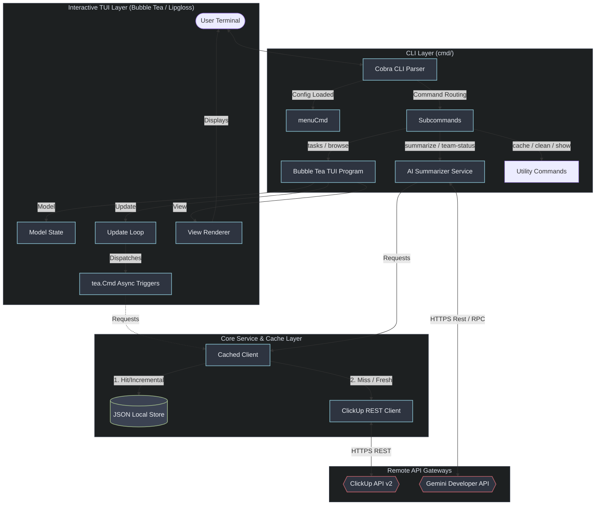
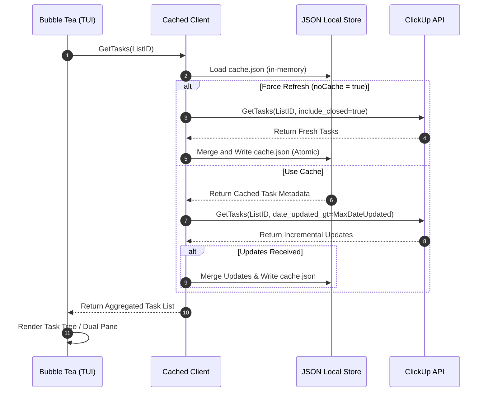
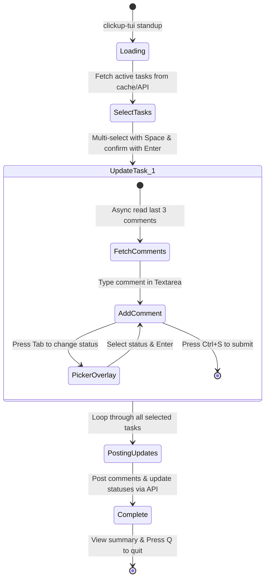

# System Architecture

This document provides a detailed overview of the system architecture, component layers, data flows, and design patterns utilized in `clickup-tui`.

---

## 1. Architectural Overview

`clickup-tui` is a terminal user interface (TUI) application constructed using Go, Cobra, and Bubble Tea. It operates as a local agent, interacting with the **ClickUp REST API** for task and workspace management and the **Gemini API** for AI summarization.

To deliver responsive performance, the application implements a layered architecture, a thread-safe local JSON caching subsystem, and async background processes.

---

## 2. Component Layers

### A. The CLI Layer (`cmd/`)
The CLI entry point is orchestrated by **Cobra**. 
- **Command Router**: Parses console arguments and options (`cmd/root.go`). It configures global, persistent flags like `--refresh` or `--clear-cache` to bypass or invalidate the local cache.
- **Menu System**: `clickup-tui menu` functions as an interactive subcommand hub, launching nested Bubble Tea programs. It retains control over the shell's active screen via alternative screen buffers (`tea.WithAltScreen`).
- **Configuration Hook**: Inspects the presence of TOML configuration on startup, throwing user-friendly guides prompting `clickup-tui setup` if missing.

### B. The TUI Layer (`pkg/ui/` & Bubble Tea Models)
The interactive interface implements the **Elm Architecture (Model-Update-View)** via the `bubbletea` package:
- **Model**: Structures the visual state (cursors, input values, active spinners, list dimensions).
- **Update**: A pure-ish message dispatcher that captures terminal events, input keys, and asynchronous completions (`tea.Msg`), modifying the state and returning commands (`tea.Cmd`).
- **View**: A declarative renderer compiling Lipgloss definitions into clean, styled ANSI terminal outputs.
- **Key Screens & Components**:
  - `browse.go`: Implements a horizontal split-pane. The left pane uses the `list` bubble, and the right uses a scrollable `viewport`. Real-time, debounce-supported comments fetching triggers asynchronously as the user navigates.
  - `standup.go`: Features a sequential, multi-step state machine (`standupState`) transitioning from multi-select task lists to text input fields and custom status pickers.

### C. The Caching Subsystem (`pkg/cache/`)
To bypass aggressive API rate-limiting and accelerate response rendering, `clickup-tui` operates a localized caching layer wrapping the raw API client.

- **Storage Structure (`Store`)**: Fully structured and serialized to a single JSON file located at `$XDG_CACHE_HOME/clickup-tui/cache.json` (or OS cache fallback).
- **Dual Caching Strategy**:
  1. **TTL-Based Caching**: Used for high-level organizational structure (Users, Teams, Folders, Lists, Comments, Task Details). If the entry age exceeds its designated time-to-live threshold, a fresh API query is dispatched.
  2. **Timestamp-Based Incremental Loading**: Active task arrays are cached alongside a high-water mark (`MaxDateUpdated`). Instead of fetching complete listings on refresh, the client issues requests with `date_updated_gt=MaxDateUpdated`, merging newly created or edited task updates incrementally into the local dataset.
- **Thread-Safety & Atomicity**: The cached client employs a memory-based structure written atomically. To prevent data corruption on crash, the flushing sequence writes data to `.cache.json.tmp` and performs an atomic POSIX file rename (`os.Rename`) onto the final file path.

### D. The AI summarizer Layer (`pkg/ai/`)
Integrates the terminal with Gemini Generative LLM APIs using LangChainGo (`github.com/tmc/langchaingo`).
- **Summarizer Services**: Formulates structured, prompt-engineered contexts using ClickUp task descriptions, assignees, dates, and discussion threads.
- **Context Injection**: Truncates lengthy descriptions and limits context arrays to avoid exceeding model token constraints.
- **Objective Summaries**: Employs strict prompt guidelines requesting objective, factual summaries devoid of hyperbolic language or subjective filler.

---

## 3. Core Data Flows

### A. The API Query Lifecycle
The following sequence details how the application retrieves data under caching policies:

### B. Guided Daily Standup Workflow
The daily standup workflow acts as a linear state machine traversing multiple screens:

---

## 4. Key Design Decisions

1. **SQLite vs. Flat-file JSON Caching**: 
   Since the configuration space and active task volume are bounded, a flat-file JSON serialization store was chosen over SQLite to eliminate CGO build requirements and simplify deployment across diverse platforms.
2. **Atomic Writes**:
   All modifications to configuration files or caches utilize temporary scratch files and atomic renaming. This guarantees files are never left half-written in the event of a sudden exit or loss of power.
3. **No-Blocking UI Loop**:
   Heavy queries—such as fetching comments or compiling team statuses—are handled in Go routines wrapped inside `tea.Cmd`. The TUI loop renders an animated Lipgloss spinner and remains interactive, avoiding UI freezes.
